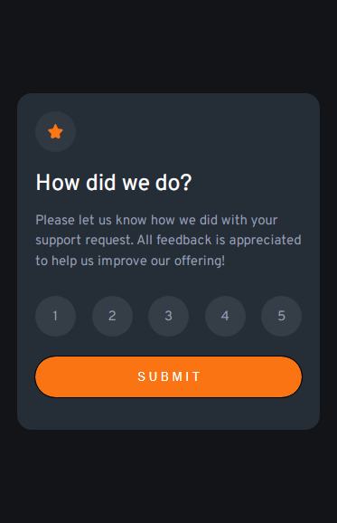
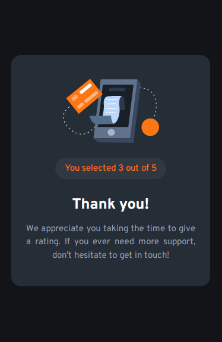
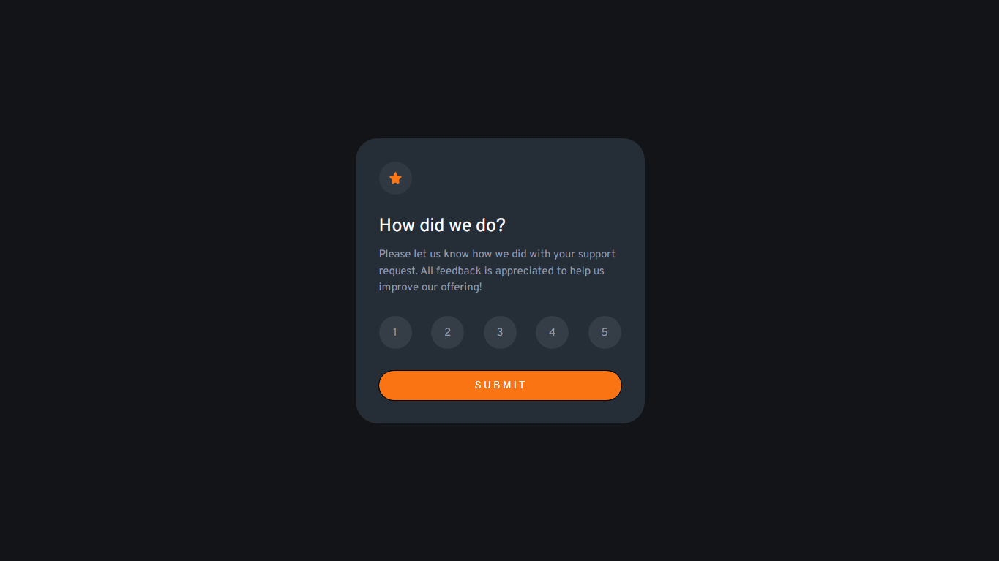
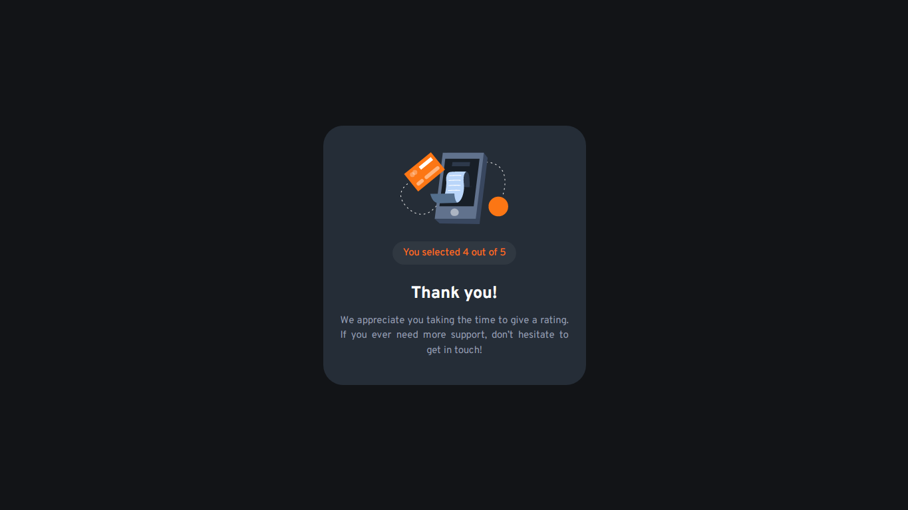

# Frontend Mentor - Interactive Rating Component Solution

This is a solution to the [Interactive rating component challenge on Frontend Mentor](https://www.frontendmentor.io/challenges/interactive-rating-component-koxpeBUmI). Frontend Mentor challenges help you improve your coding skills by building realistic projects.

## Table of contents

- [Frontend Mentor - Interactive Rating Component Solution](#frontend-mentor---interactive-rating-component-solution)
  - [Table of contents](#table-of-contents)
  - [Overview](#overview)
    - [The Challenge](#the-challenge)
    - [Screenshots](#screenshots)
  - [Links](#links)
  - [Built With](#built-with)
  - [Author](#author)

## Overview

### The Challenge

Users should be able to:

-   View the optimal layout for the app depending on their device's screen size
-   See hover states for all interactive elements on the page
-   Select and submit a number rating
-   See the "Thank you" card state after submitting a rating

### Screenshots

 

## Links

[Live Site URL](https://mmc-interactive-rating-component.vercel.app)

## Built With

-   HTML5
-   CSS3
-   JavaScript
-   [Google Fonts](https://fonts.google.com/)

## Author

Matheus Mariano de Camargo  
[Linkedin](https://www.linkedin.com/in/matheus-mariano-de-camargo-667488244/)  
Frontend Mentor - [@MMCamargo](https://www.frontendmentor.io/profile/MMCamargo)
